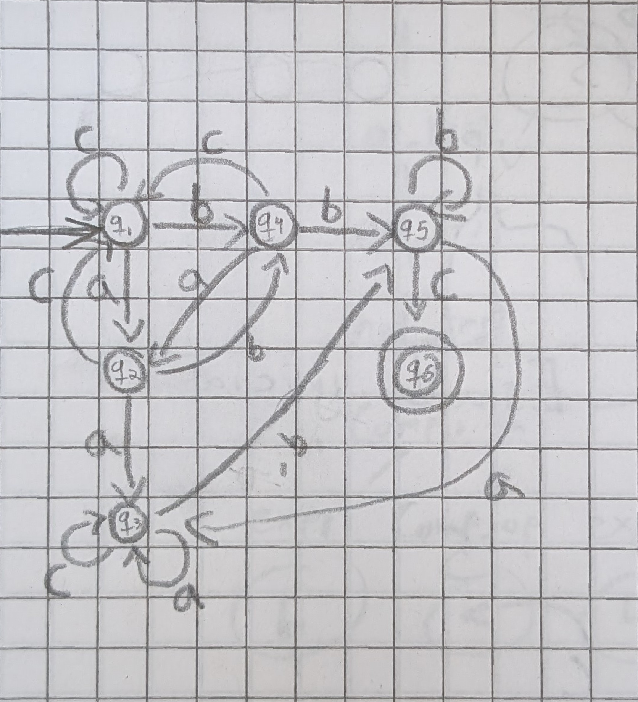
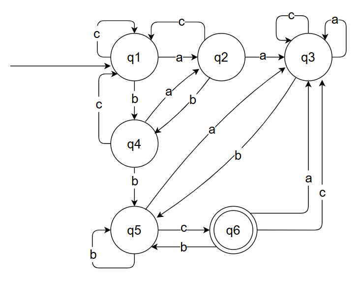
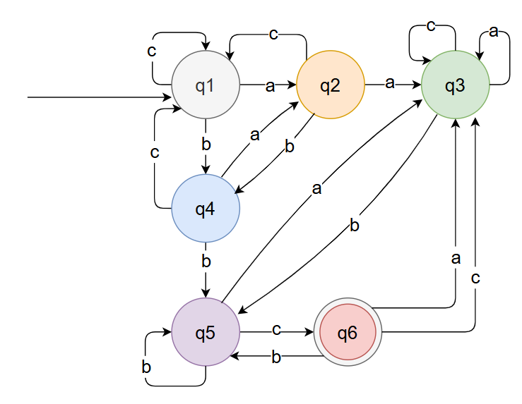
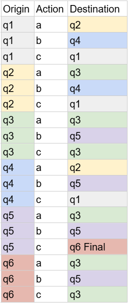
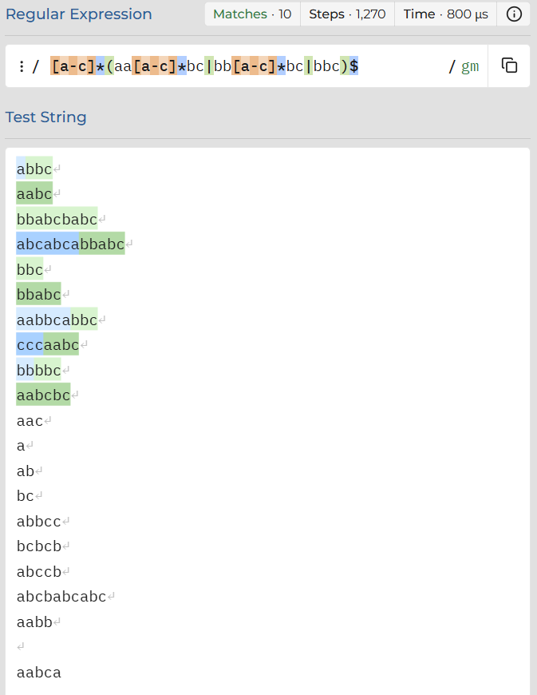

# Evidencia Implementación de Análisis Léxico (Automata y Expresión Regular)

Joel Guadalupe García Guzmán - A01713785


## Descripción

El lenguaje que voy a analizar es Σ = {a,b,c} con las siguientes restricciones:
<ul>
    <li>Tiene que tener <b>aa</b> o <b>bb</b></li>
    <li>Tiene que terminar en <b>bc</b></li>
</ul>

## Soluciones con DFA

Por la forma en que trabajé mi DFA primero crearé el diagrama del DFA y ya que esté correcto estableceré la estructura formal de un DFA. (Gopalakrishnan, pág 43)

### Diagramas de autómata



<b>Versión 1 de mi diagrama de DFA.</b>
En aspectos visuales al ser hecho en libreta no tiene la limpieza esperada.
De la misma forma tiene algunos errores de lógica. Por ejemplo, al llegar a q6 ya no tiene a donde ir, por lo tanto si en algún momento llega a terminar en q6 y siguen otros caracteres a analizar, se creará un problema.



<b>Versión 2 de mi diagrama de DFA.</b>
Fue traducido a un diagrama digital, y en general limpiando las líneas de transición para mejorar la claridad.
Todos los errores de lógica fueron corregidos. Ahora si fue considerado el caso que llegue a q6 sin haber terminado la expresión.

| Origin | Action | Destination |
| :--- | :---: | ---: |
| q1 | a | q2 |
| q1 | b | q4 |
| q1 | c | q1 |
| q2 | a | q3 |
| q2 | b | q4 |
| q2 | c | q1 |
| q3 | a | q3 |
| q3 | b | q5 |
| q3 | c | q3 |
| q4 | a | q2 |
| q4 | b | q5 |
| q4 | c | q1 |
| q5 | a | q3 |
| q5 | b | q5 |
| q5 | c | q6 Final |
| q6 | a | q3 |
| q6 | b | q5 |
| q6 | c | q3 |

<b>Tabla de estados</b>

Adjunto diagrama de DFA y tabla de DFA con coordinación de colores para mayor claridad visual.

 <br>


### Declaración formal de autómata

Según la explicación del profesor Ganesh Lalitha Gopalakrishnan, un DFA tiene que tener 5 elementos en una tupla los cuales son los siguientes:

<i>"Formally, a deterministic finite-state automaton D is described by five items presented as a tuple (...)
Q is a finite nonempty set of states, <br>
Σ is a finite nonempty alphabet, <br>
δ : Q ×Σ → Q is a total transition function, <br>
q0 ∈ Q is the initial state, and <br>
F ⊆ Q is a finite, possibly empty set of final (or accepting) states."</i> <br>(Gopalakrishnan 2019)

Por lo tanto, la definición formal de mi autómata es la siguiente:
<ul>
    <li>Q = {q1, q2, q3, q4, q5, q6}</li>
    <li>Σ = {a, b, c}</li>
    <li>δ : <i>todas las conexiones de la tabla superior</i></li>
    <li>q0 ∈ q1</li>
    <li>F ⊆ {q6}</li>
</ul>

### Explicacion de mi DFA

En este proyecto estoy usando un Autómata Determinístico Finito (<b>DFA</b> por sus siglas en inglés).

Mi DFA se basa en que en cuanto llegues ya sea a q3 o q5 significa que ya has cumplido con la regla de "tener 'aa' o 'bb' almenos una vez", por eso mismo una vez que llegas a esos 2 estados no puedes volver a q1, q2 o q4.
Después de esto, q3 representa haber llegado desde una 'a' y q5 representa llegar desde una 'b'.
Mi única posición final es q6, y para llegar a este estado solo lo puedes hacer dando un salto si ocurre la letra 'c' desde el estado q5, así asegurandonos la condicion que termine en 'bc'.

### Pruebas de mi DFA

Para probar mi DFA vamos a usar el programa prolog y vamos a correr el script \'tests.pl' el cual contiene varias pruebas de mi lenguaje. Dentro de ahí manda a llamar el script \'automataTester.pl' donde viene la lógica de mi DFA.

Dentro del script primero especifico todas las conexiones de mi DFA, esta parte es solamente traducir de mi DFA a código de prolog. Su estructura es <i>connects(a,b,c)</i>, donde 'a' y 'c' son estados, y 'b' es la conexion que va de 'a' hacia 'c'. Ejemplo de todas las conexiones de q1 con todas las diferentes letras.

```
connects(q1,a,q2).
connects(q1,b,q4).
connects(q1,c,q1).
```
También es importante declarar que solamente q6 es el estado final, por lo que tenemos que declararlo en prolog.

Después la parte que sí maneja la lógica 
```
% Condicion final, solo va a entrar cuando se haya terminado el string
avanzar([],Estadofinal,_):-
    final(Estadofinal).
```
``` 
% Funcion principal, recorre todo el DFA
avanzar([Action|Rest], Current, Answer):-
    connects(Current,Action,Nextpos),
    avanzar(Rest,Nextpos,Answer).
```
El segundo bloque de código va a ocurrir siempre que el string aún tenga caracteres por recorrer. Lo que hace es buscar la conexion del estado Current con Nextpos y guarda el estado al que se dirige como Nextpos, donde si aún quedan objetos en la lista se vuelve a ejecutar hasta que no quede ninguno.

El primer bloque de código es la condición de paro, la cual es que la lista esté vacia, es decir, que ya la hayamos recorrido por completo, donde revisa si el Estadofinal si sea el final, es decir, q6.

## Soluciones con Regex


<b>((a|b|c)\*((aa)|(bb))(a|b|c)\*(bc))|((a|b|c)*(bbc))</b>
La primera solución es funcional, sin embargo no es la más optima<br>

<b>\/[a-c]\*(aa[a-c]*bc|bb[a-c]*bc|bbc)$/mg</b><br>
la segunda solución es mucho más compacta. Para esto he dividido mis reglas en 3 casos específicos:
1) Que el string contenga 'aa' y termine en 'bc'
2) Que el string contenga 'bb' y termine en 'bc'
3) Caso especial que el string termine en 'bbc'

También tuve que agregar el caracter '$' al final de la expresión para que el detector en línea [regex101](https://regex101.com) considere a la línea completa al revisar si el string es válido o no.

También he agregado las banderas de regex /m y /g. La primera sirve para que regex pueda revisar varias múltiples líneas separadas por un <i>endline</i>. y la segunda sirve para que nos pueda marcar como válidos varios resultados en lugar de solo encontrar uno y finalizar la búsqueda.

### Pruebas con regex

He probado mi expresión con los mismos ejemplos que usé en mis pruebas de DFA. He tenido los mismos resultados en ambas pruebas:



Los primeros 10 strings deberían de ser marcados como válidos, de acuerdo con mis pruebas de mi implementación de DFA en prolog, mientras que las últimas 11 pruebas deberían de ser inválidas, cosa que concuerda con mis previas pruebas.

## Análisis de complejidad


## Referencias

Automata and computability : a programmer’s perspective / Ganesh Lalitha Gopalakrishnan. (2019). CRC Press, Taylor & Francis Group, page 42

Mozilla (2025) Regular expression syntax cheat sheet from Developer Mozilla from https://developer.mozilla.org/en-US/docs/Web/JavaScript/Guide/Regular_expressions/Cheatsheet 

Wat A. (5 de febrero de 2005)